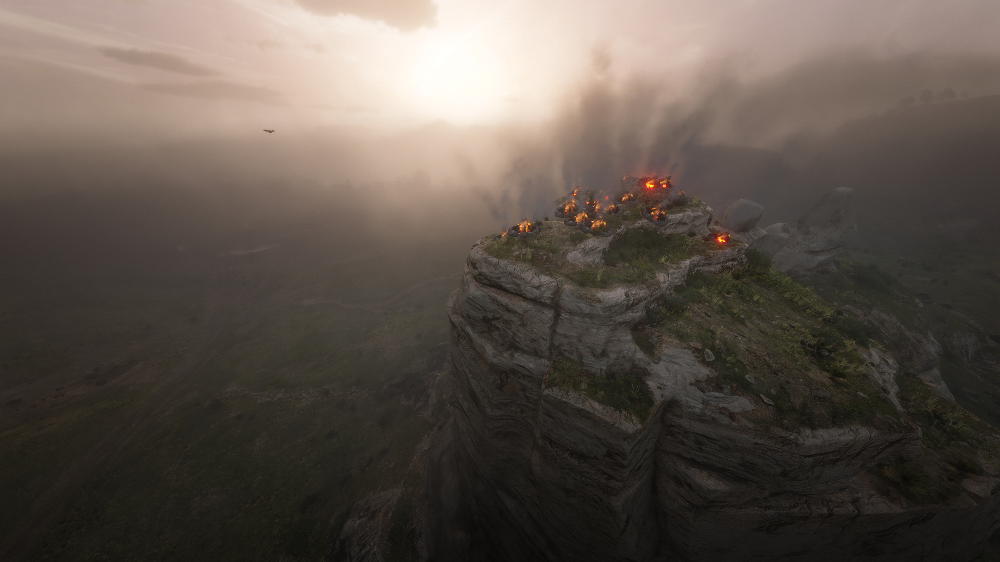

# There Is a Light That Never Goes Out
By 2girls1comp

A mod for Red Dead Redemption 2 that adds a permanent bonfire at every location where an NPC dies.

GAMEPLAY TRAILER:
https://www.youtube.com/watch?v=VeI8Elsrv_w

INSTALLATION:
- Copy "thereIsALightThatNeverGoesOut.asi" into the root folder of RDR2.

USAGE:
- press F10 to toggle the mod
- the first time the mod is used, a text file called "output.txt" will be created in the root folder of RDR2
- press F11 to toggle snake mode

REQUIREMENTS:
- [Script Hook RDR2 V2 by kepmehz](https://www.nexusmods.com/reddeadredemption2/mods/1472?tab=files&file_id=16307). NOTE: if you use Alexander Blade's Script Hook RDR2, the mod will not work properly.
- [dinput8.dll](https://github.com/ThirteenAG/Ultimate-ASI-Loader/releases/download/x64-latest/dinput8-x64.zip)

